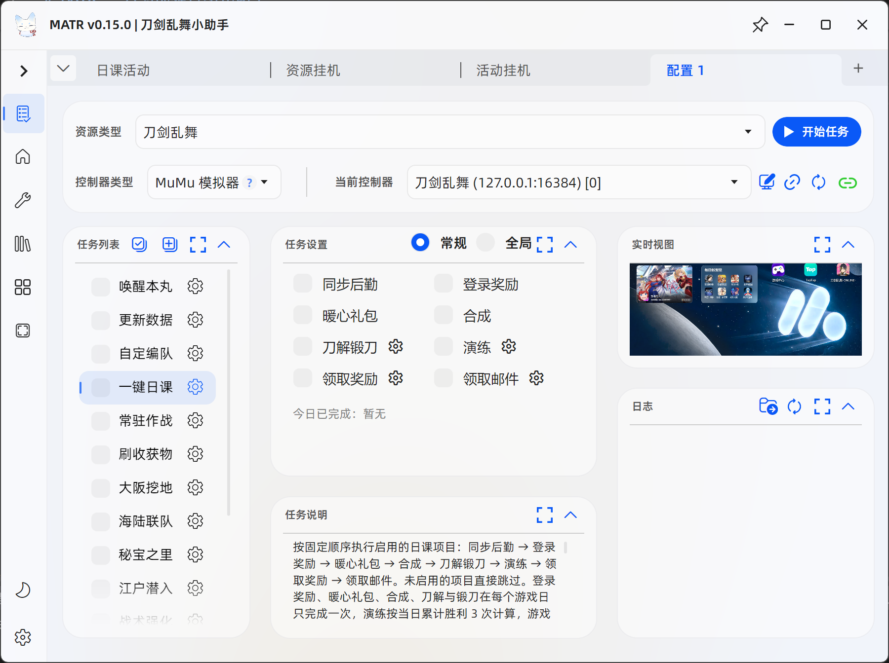
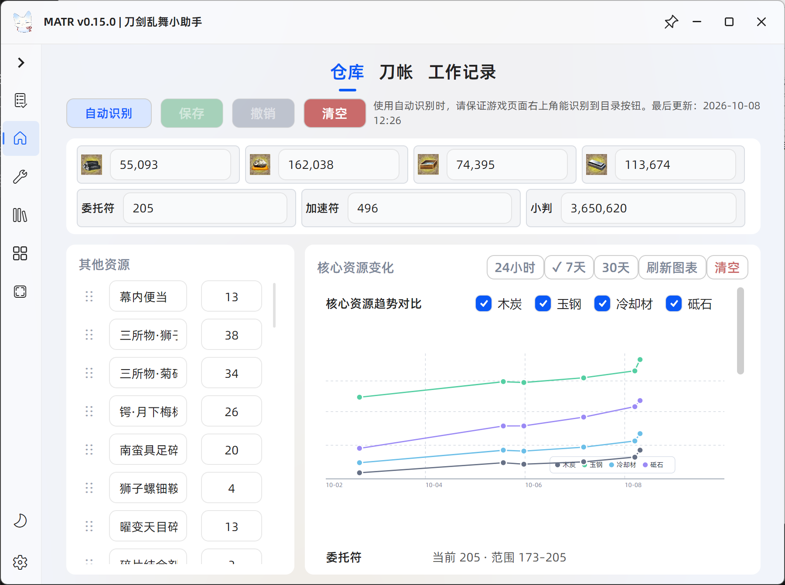
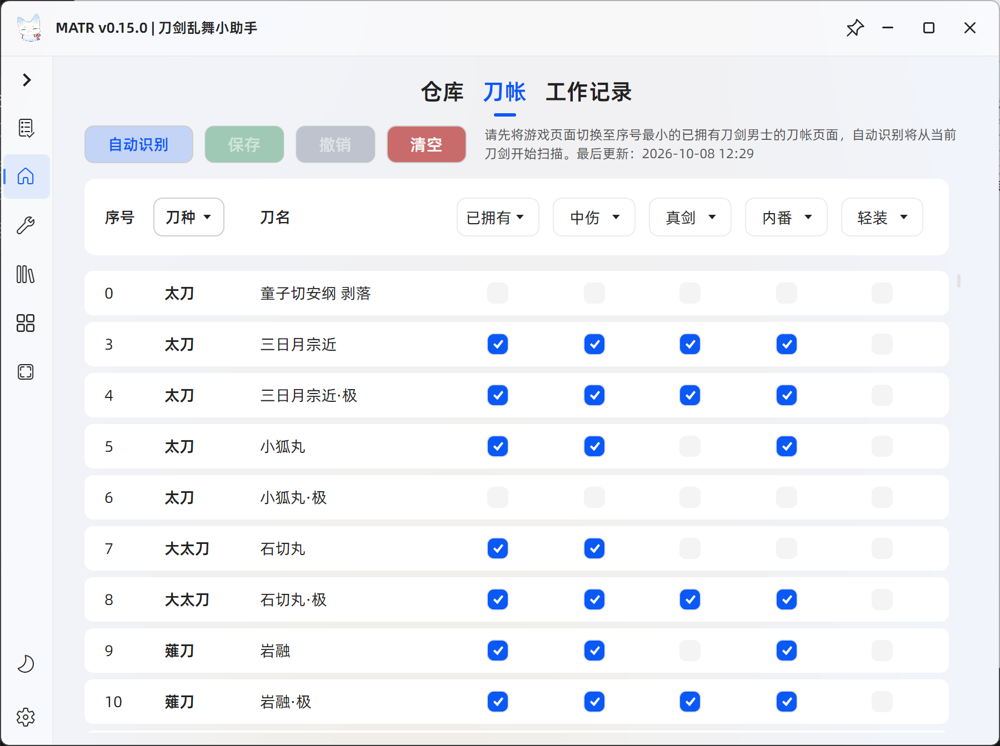
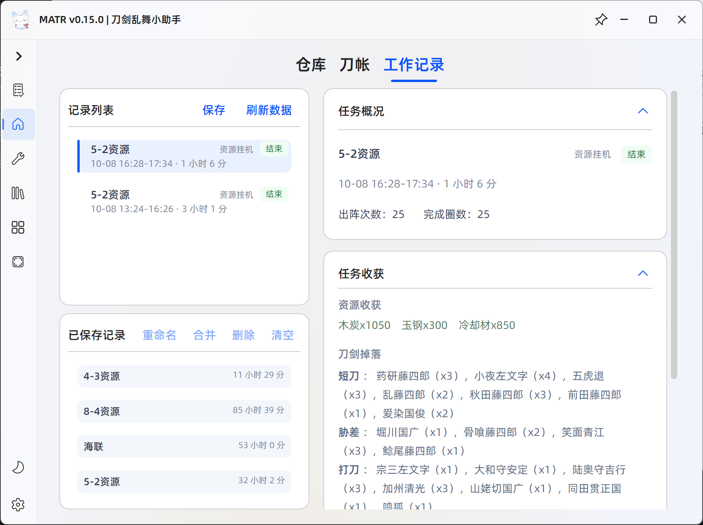
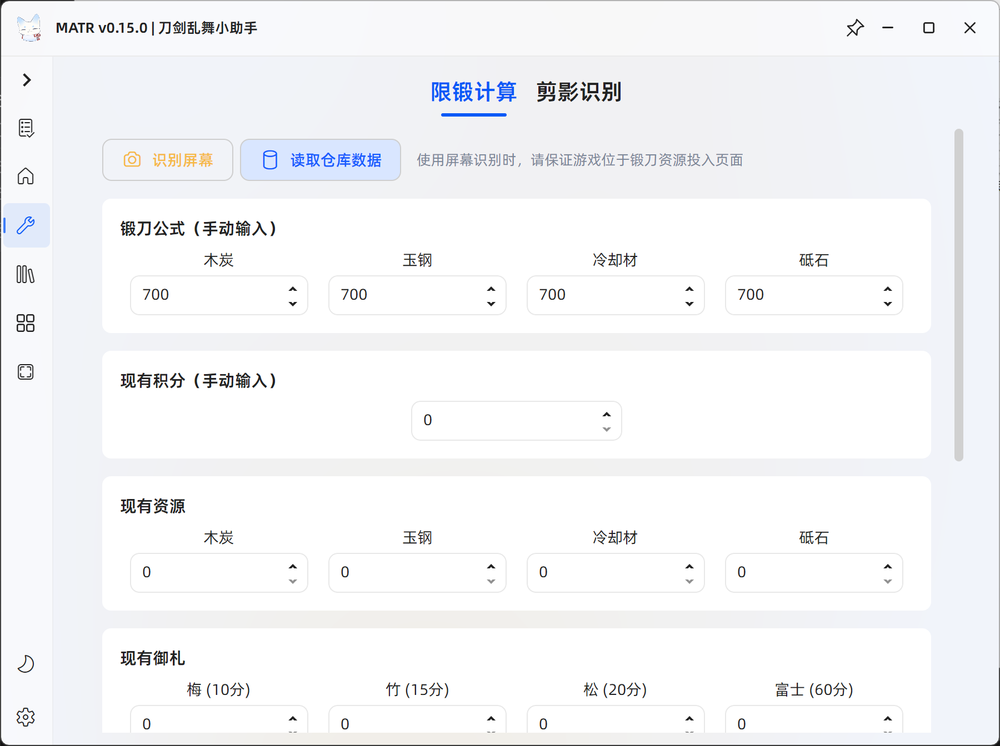
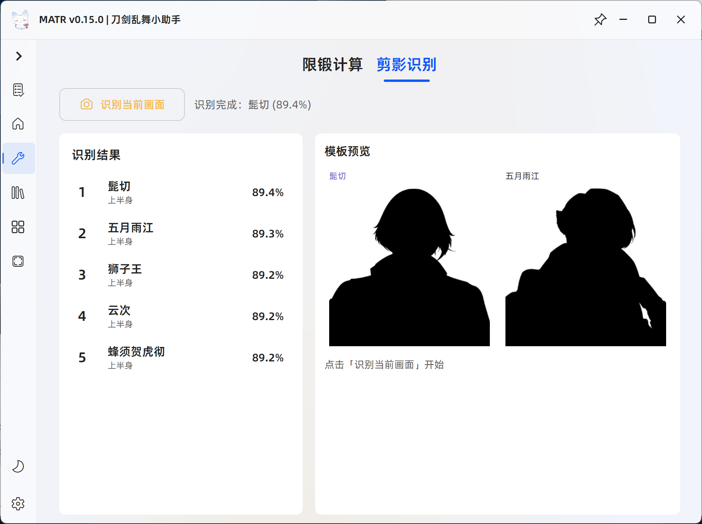
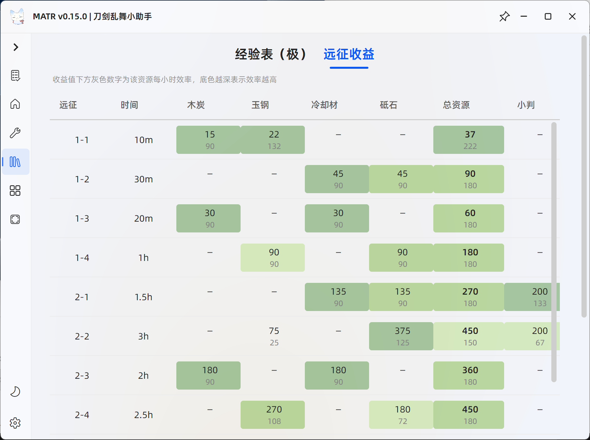
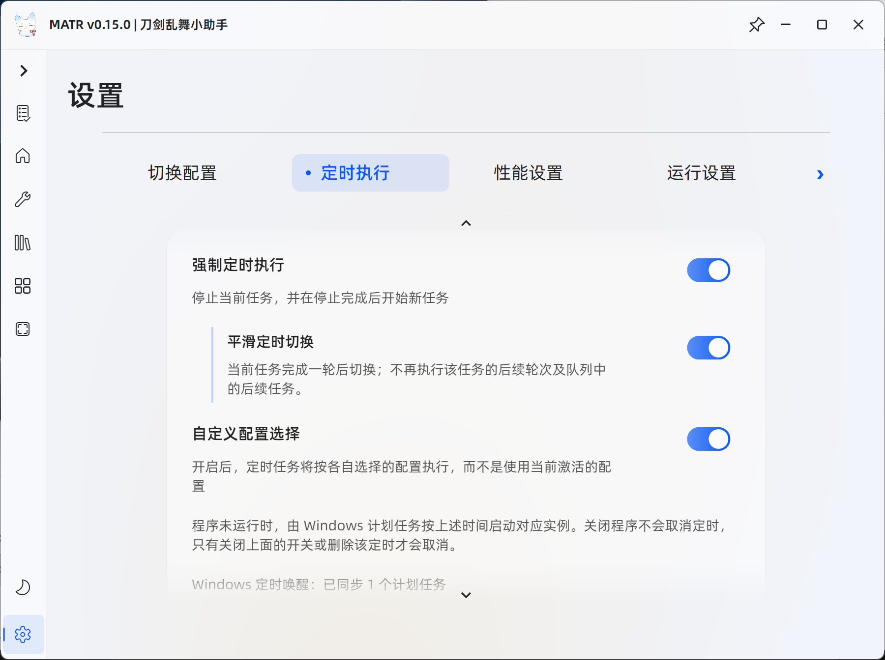
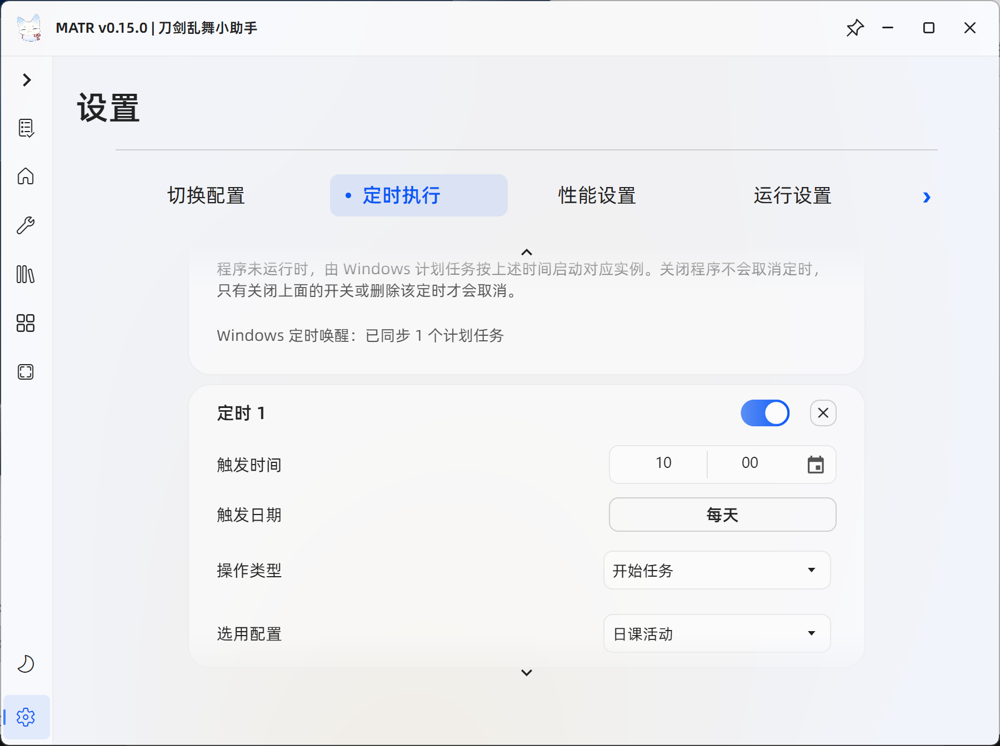

<!-- markdownlint-disable -->

<div align="center">


# MATR — 刀剑乱舞自动化助手

<br>
<p align="center">
  
  
  
  <a href="https://github.com/MaaXYZ/MaaFramework"></a>
  <br>
  
  
</p>

基于 MaaFramework 的《刀剑乱舞》国服 PC 端自动化助手，通过 ADB 连接模拟器，以画面识别驱动任务执行，帮助完成日课、出阵、活动与本丸管理等重复操作。

</div>

> [!TIP]
>
> 本项目目前处于快速迭代更新阶段，欢迎提交 PR 和 Issue。无论是使用中遇到的问题、功能建议，还是其他想法，都欢迎提出。也感谢每一位愿意使用、测试 MATR 并提出问题和建议的用户，项目的持续完善和发展离不开你们的支持与反馈。

## ⚠️ 免责声明与风险提示

> [!NOTE]
>
> 本项目基于 [MaaFramework](https://github.com/MaaXYZ/MaaFramework)（LGPL v3）构建，采用 [GNU General Public License v3.0](LICENSE) 协议，**永久免费且开源**。
>
> - 本项目为非计算机专业人员心血来潮之作，大量依赖 vibe coding 完成，仅供学习交流使用。
> - 程序图标（含 `assets/resource/logo/` 等图标资源）不随项目开源，著作权归 [米酒气泡水](https://huajia.163.com/main/profile/wEayJn7E) 所有，商用权归开发者所有。
>
> 本软件为第三方工具，通过识别游戏画面模拟常规交互动作，简化《刀剑乱舞-ONLINE-》的重复性操作。本项目遵循相关法律法规，绝不会修改任何游戏文件或数据。
>
> 因使用本软件而产生的任何问题，均与本项目及开发者无关。
>
> - 请勿在任何平台的《刀剑乱舞-ONLINE-》官方账号下提及 MATR。

> [!CAUTION]
>
> 根据游族网络《刀剑乱舞-ONLINE-》用户许可协议，严禁使用任何形式的妨碍游戏公平性辅助工具或程序（外挂）。官方已多次对违规账号采取封禁措施，包括但不限于封号警告、永久封禁等处罚。
>
> **您应充分了解并自愿承担使用本工具可能带来的所有风险，包括账号封禁、数据丢失等。**

## 下载与安装

前往 [Releases](https://github.com/NotZoruak/MATR/releases)，在最新版本的“Assets”中下载对应压缩包并解压到空目录。

- Windows：下载 `MATR-vx.x.x-win-x64.zip`。
- Apple Silicon Mac：下载 `MATR-vx.x.x-macos-arm64.zip`。

Windows 用户双击 `MATR.exe` 即可启动；macOS 用户打开 `MATR.app`。首次启动可能需要较长时间，请耐心等待。

> [!NOTE]
>
> Windows 启动时如提示缺少“.NET Desktop Runtime 10.0”或 `VCRUNTIME140.dll`，请右键 `DependencySetup_依赖库安装_win.bat`，选择“以管理员身份运行”；安装完成后重新启动 MATR。
>
> 已安装用户可在软件设置中检查更新，并在 GitHub 与 [Mirror酱](https://mirrorchyan.com) 下载源之间切换。Mirror酱下载需购买 CDK 激活。

## 首次使用

1. 安装并启动 **MuMu 模拟器 12**。
2. 将模拟器分辨率设为 **1280×720**、DPI 设为 **240**；这是 MATR 当前唯一推荐且完成适配的运行环境。
3. 在模拟器中启动《刀剑乱舞》，进入游戏后保持模拟器窗口可见，不要遮挡或缩放画面。
4. 启动 MATR，点击刷新或重新连接，等待连接 ADB成功；连接成功后即可勾选任务并开始执行。若 MATR 无法扫描到 ADB 地址，也可以在 ADB 编辑器中进行自定义。

> [!WARNING]
>
> 不建议使用其他模拟器，请不要使用 1280*720 以外的分辨率。识别模板均基于 1280×720、240 DPI 制作，错误的环境会导致任务无法识别或误操作。

## 功能介绍

日课一键完成，本丸后勤自动调度；无缝远征、远征队伍自动刷花、定时启动、多实例切换，长草期 24 小时运行——MATR 全都能做到！

- **一键日课**：自动处理登录奖励、暖心礼包、习合、刀解与锻刀、演练，领取任务奖励和邮箱中的物资。
- **本丸后勤**：集中安排远征、修刀与内番；也可通过出阵任务中的「同步后勤」，在出阵间隙执行后勤安排。
- **常驻作战与活动**：支持常驻作战（合战场或异去）、大阪挖地、海陆联队、秘宝之里、江户潜入、战术强化训练与刷花回气，并提供重伤、疲劳、刀装相关的自定义设置。
- **自定编队**：使用预设自动配置部队、刀装、马匹与宝物。
- **异常恢复**：可处理常见弹窗、游戏异常与模拟器无响应；启用相关设置后，自动恢复并继续任务。
- **本丸**：包含仓库、刀帐和工作记录，可管理仓库资源与道具、查看刀剑收集情况，并按任务回顾出阵和掉落记录。
- **工具**：提供限锻计算和剪影识别小工具。
- **资料库**：提供极化经验表和远征收益查询。

<details>
<summary>界面展示</summary>

<br>



















</details>

## 使用说明

### 任务执行

在主页勾选需要的任务后开始执行。可通过拖动调整任务顺序，并在每个任务的设置中选择部队、难度、目标层数、疲劳处理或同步远征等选项。长期运行前，请先以少量次数确认任务和游戏状态符合预期。

执行出阵类任务时，建议开启重伤处理、刀装保护和疲劳撤退等保护选项。涉及疲劳处理、自动购买活动门票或刀解的功能，建议首次使用时有人值守。

### 本丸与数据

“本丸”提供仓库、工作记录和刀帐三个页面。仓库可识别、编辑并保存资源与道具数据，查看核心资源变化；工作记录可按任务查看出阵、行军、掉落和资源收获；刀帐可识别并统计已拥有的刀剑立绘。

数据更新任务可按设置自动识别仓库和刀帐。个人数据仅保存在本机运行目录，不会上传到仓库或随发布包分发。

### 日志与反馈

遇到问题时，请在任务页面“日志”卡片右上角点击文件夹图标，选择需要的日志和截图后点击“导出日志”。随后在 [GitHub Issues](https://github.com/NotZoruak/MATR/issues) 提交反馈，并尽量提供：

- 问题出现前的操作与任务设置。
- 预期结果和实际结果。
- 相关截图与导出的日志压缩包。

提交前请先搜索已有 Issue，避免重复。日常交流、使用咨询和经验分享可加入 QQ 频道：`pd68335487`。

## 参与开发

欢迎通过 Issue 讨论功能建议与问题，也欢迎直接提交 PR。需要从源码运行时，请先安装 [.NET 10 SDK](https://dotnet.microsoft.com/download/dotnet/10.0)，然后执行：

```powershell
git clone https://github.com/NotZoruak/MATR.git
Set-Location MATR
dotnet run --project _src/MFAAvalonia.Desktop
```

开发与贡献请参阅 [贡献指南](./CONTRIBUTING.md)：其中包含[开发环境与构建命令](./CONTRIBUTING.md#开发环境)、[Pipeline 与资源 JSON 规范](./CONTRIBUTING.md#pipeline-与资源-json)和[跨平台要求](./CONTRIBUTING.md#跨平台要求)；发布流程请参阅[分支流程](./docs/分支流程.md#版本发布)。

## 致谢

- [MaaFramework](https://github.com/MaaXYZ/MaaFramework) — 基于图像识别的自动化黑盒测试框架。
- [MFAAvalonia](https://github.com/SweetSmellFox/MFAAvalonia) — 基于 Avalonia UI 的 MaaFramework 通用 GUI 方案。
- [MaaAssistantArknights](https://github.com/MaaAssistantArknights/MaaAssistantArknights) — README 信息架构参考。
- [Mirror酱](https://mirrorchyan.com) — 软件分发与 CDK 激活管理平台。
- [MFAToolsPlus](https://github.com/SweetSmellFox/MFAToolsPlus) — MaaFramework 开发辅助工具箱。
- [MaaLogAnalyzer](https://github.com/MaaXYZ/MaaLogAnalyzer) — 可视化日志分析工具。

感谢 MaaFramework 提供自动化框架和低代码开发流程，以及 MFAAvalonia 提供图形化界面方案。也感谢每一位提交反馈、测试、贡献代码与支持 MATR 的用户。

[](https://github.com/NotZoruak/MATR/graphs/contributors)

## Star History

如果 MATR 对你有帮助，欢迎点亮仓库右上角的 Star，这会是对项目最直接的支持。

<a href="https://star-history.com/#NotZoruak/MATR&Date">
  
</a>
